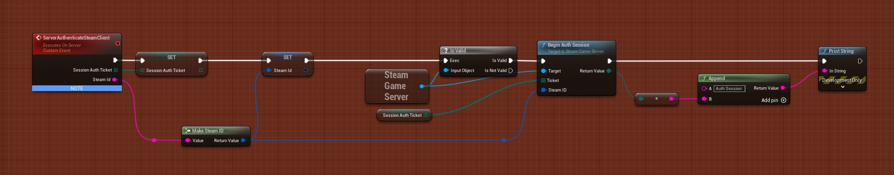

# Authenticating Steam Users 

If you are hosting a multiplayer game (or single player), you might want to validate/authenticate the player. With SteamCore it’s very easy!

## PlayerController

## Begin Auth Session
Depending on your setup, if you are using Dedicated Servers to authenticate users use “GameServer” example, if you are using a “Single Player” or “Listen Server” setup use the “User” example.

## Cleaning Up
Destroy/Invalidate the authenitcation ticket when the player exits the game (Inside the PlayerController)

