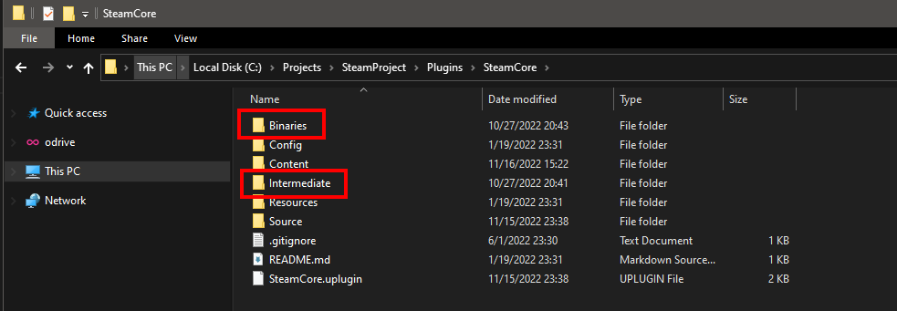

# Installing the plugin

## Installing
- Find the plugin in the Epic Launcher.


- Install the plugin to your desired Engine Version.


- Verify that the plugin is installed


- **Move** (not copy) the plugin from the engines marketplace directory to your own projects Plugins directory, you may have to create the Plugins directory in your project if it doesn't exist.


- UE 4.27 Location
```
C:\Program Files\Epic Games\UE_4.27\Engine\Plugins\Marketplace
```

## Force Plugin/Project recompile (optional)
- **Delete** the Binaries, Build, Intermediate and Saved folders inside your project directory.


- **Delete** the Binaries and Intermediate folders inside the SteamCore plugin directory.



## C++ project
- If this is a C++ project, add "SteamCore" as a module dependency in your projects Build.cs file.


## Enabling the Plugin
Make sure the **SteamCore::** plugin is enabled
