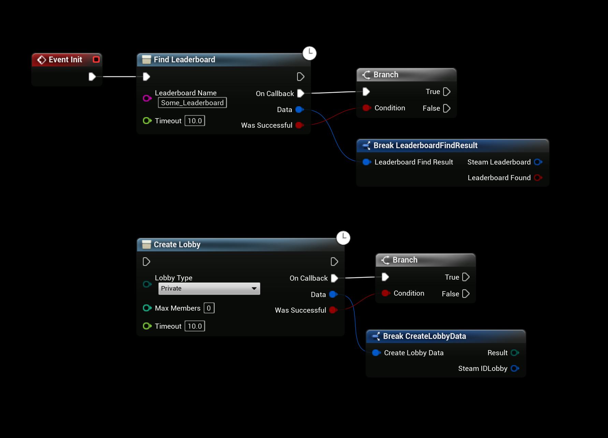
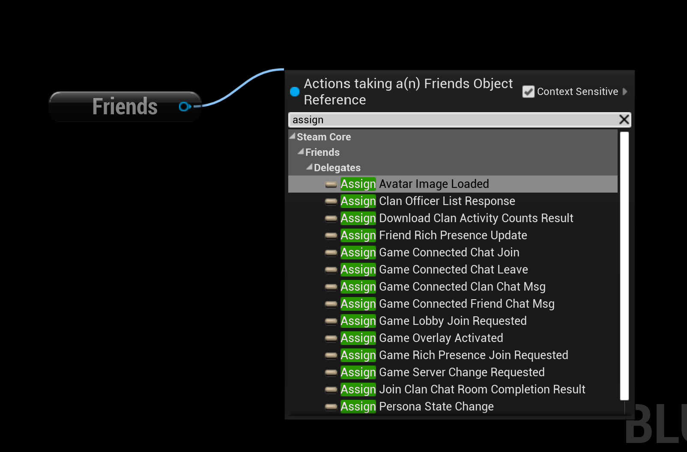
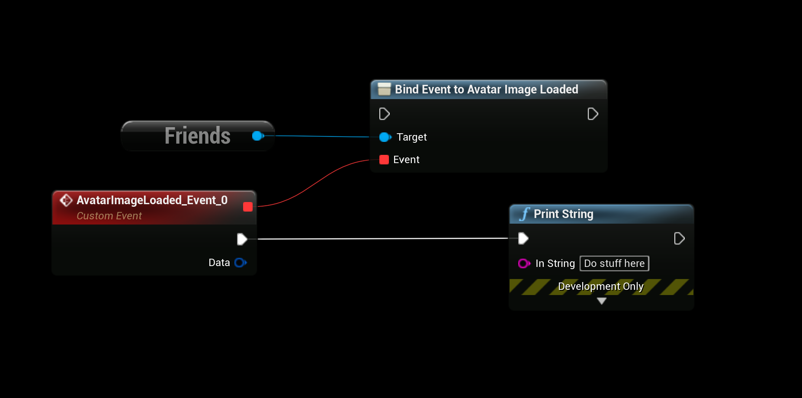
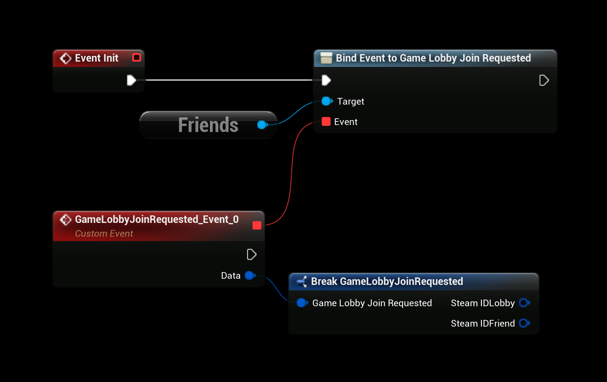

# Using the Plugin

## Testing Steam Functionality
To test steam functionality properly, see the [Testing Steam Functionality Documentation](testing_steam_functionality.md)

## SteamCore Functionality
Right click in any blueprint and search for “steamcore” to see the available subsystems and functions/methods

## Steamworks Documentation
All the plugin/blueprint nodes are named the same as in the official Steamworks Documentation, this makes it super easy and useful to follow the official steamworks documentation.
- [https://partner.steamgames.com/doc/api](https://partner.steamgames.com/doc/api)

## Async Functions
SteamCore has a lot of async functions that you can use to call Steam functionality, the most important note about Async functions is that you connect the correct "output" node.
:::tip NOTE
Always use the "Callback" execution pin when you use the Async functions
:::

### More Async Functions
You can find more Async functions if you look in the blueprint context menu under "steamcore" and the "async" category.

## Delegates
The Steamworks SDK has a lot of different delegates that can be bound and used when needed, these delegates are also available with the SteamCore plugin and enables you to use them in your Blueprints.

### Assign the delegate
Using the "assign" keyword will automatically create the correct event signature needed for the delegate.

### Delegate bound
This is how a "bound" delegate looks like, for example this event will execute every time steam notices a change to a friends Avatar.

Here is another example, when a lobby join is requested in the friends interface this event will be executed from the Steam Client.

### More on Delegates
- You can find more information about the available delegates on the [Steamworks Documentation Website](https://partner.steamgames.com/doc/api/ISteamFriends#callbacks)

## Example Project
- [Download the Example Project](../../example-project.md) to see more examples on how to use the SteamCore plugin