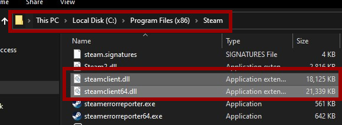
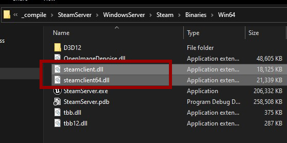
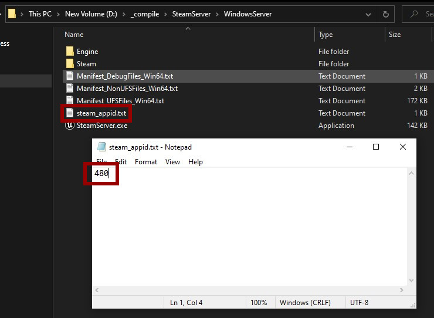

# Initializing the Dedicated Server
:::tip TIP
This Example has a Video Tutorial that you can find here: [Related Video](../../videos/dedicated-server.mdx)
:::


# Steam Functionality
If you want to use Steam functionality on your server you'll have to copy the steamclient libraries to your dedicated server, see the examples below.

## steamclient libs

### Windows Server
- Locate the steamclient libs



- Copy the steamclient libs to the same location as your servers executable



### Linux Server
- Locate your steamclient.so file

```cpp
hulken@gameserver:~$ find . -name "*steamclient.so*"
./.local/share/Steam/steamcmd/linux32/steamclient.so
./.local/share/Steam/steamcmd/linux64/steamclient.so
./.steam/sdk64/steamclient.so
``` 

#### Copy the steamclient.so file to your server location
```cpp
cp /home/hulken/.local/share/Steam/steamcmd/linux64/steamclient.so /home/hulken/LinuxServer/STEAM/Binaries/Linux/
```

## steam_appid.txt
- In some cases the server does not have permissions to create the steam_appid.txt automatically so you can do this manually by creating a steam_appid.txt at the root of the server, the contents of your steam_appid.txt should only contain your **Steam AppId** and nothing else.

### Windows Example


### Linux Example
```cpp
hulken@gameserver:~/LinuxServer$ echo "480" > steam_appid.txt
```