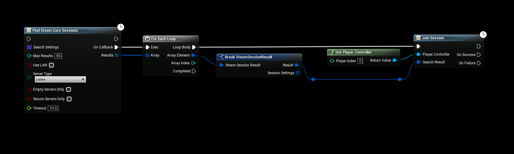

# Joining Multiplayer Games

:::danger NOTE
Steam Multiplayer Sessions in Unreal Engine 5.1, 5.2 and onwards are broken and require a hotfix. Joining sessions is broken due to new Epic implementations that does not take engine changes into account.

[You can find these changes on our discord server](https://eeldev.com/help)
:::

:::tip TIP
This Example has a Video Tutorial that you can find here: [Related Video](../../videos/multiplayer-sessions.mdx)
:::

## Joining a Session
When you've found a session to join you simply invoke the "**Join Session**" node and the Steam OSS will take care of the rest, please note that the example below should not be used as it will join every result it finds. It's simply an example of how to use the **Join Session** node.
