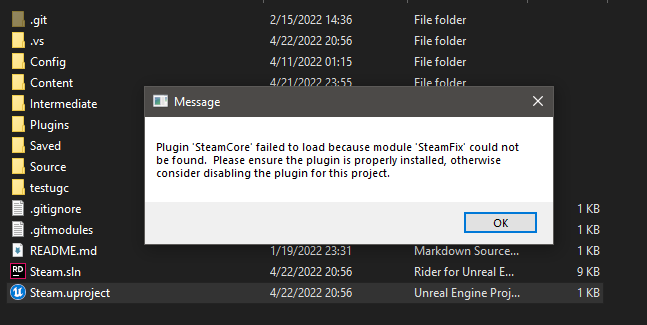
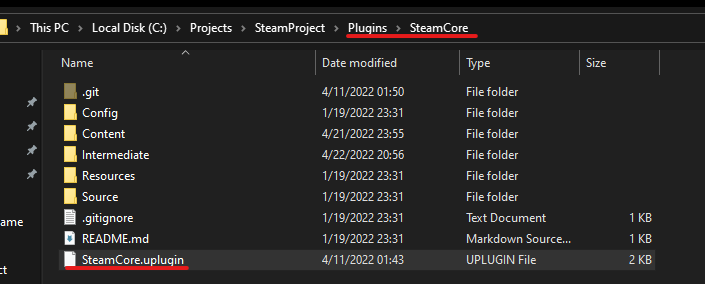
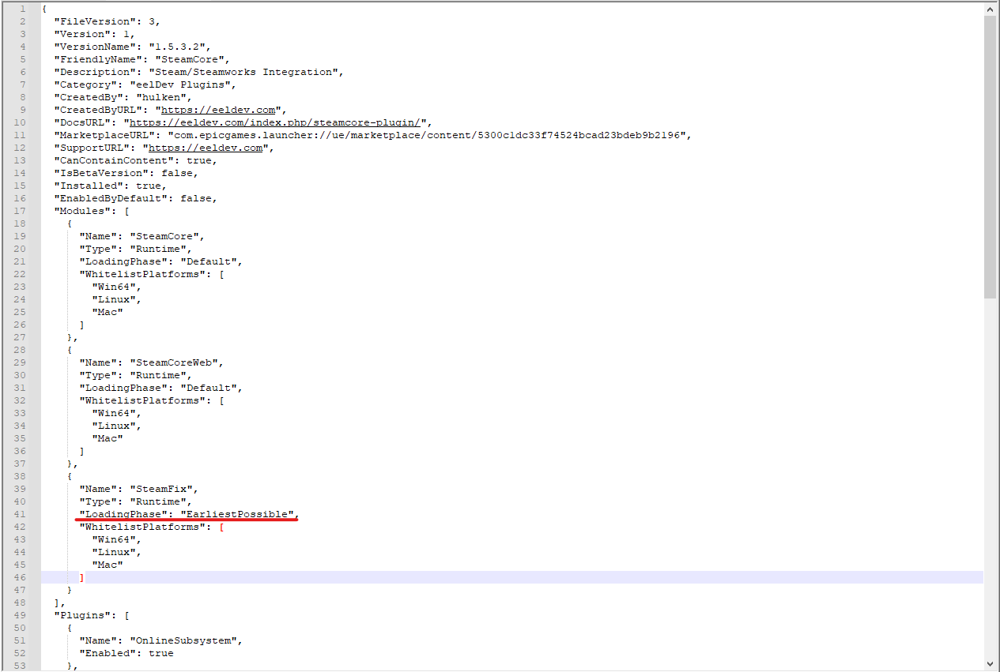
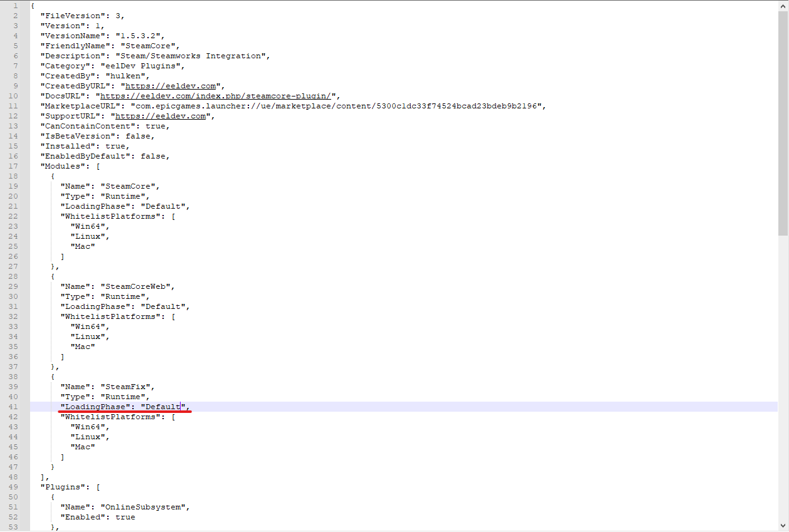
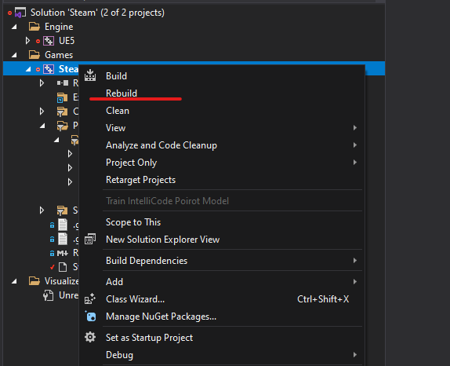

# SteamFix

:::tip NOTE
The SteamFix module that is included with SteamCore is a plugin module that fixes Steam Initialization in the editor when Epic made a few changes to the engine in 4.25, this fix allows you to initialize steam in a standalone instance in the editor for 4.25 and 4.26. The fix is no longer needed in 4.27 and onwards and can be disabled.
::: 

If you're using the plugin with a different engine installation then the one the plugin was installed for (for example using a source built version of unreal engine) then the binary files for the plugin will have to be re-compiled and this is why you might get a "SteamFix" error when trying to launch the project.

## SteamFix Error
What the error message looks like

## First Method (Simple)
The first method will apply to most people and configurations as all you need to do is edit the plugins .uplugin file and change the LoadingPhase of the SteamFix module.

### Editing the  SteamCore.uplugin
1. Open the **SteamCore.uplugin** file with a text editor (notepad or equivalent)

1. Look for the **SteamFix** module

1. Change the **LoadingPhase** from **EarliestPossible** to **Default** as seen in this example

1. Save and Close the text editor

You should now be able to double click your .uproject file to re-compile the plugin, remember to change back the **LoadingPhase** if you are using any of the engine versions mentioned above to enable Steam Initialization in the editor.

## Second Method
The second method is simply a matter of re-compiling the project in Visual Studio, if you have a C++ project you can open your .sln file using Visual Studio and re-compile the project.

